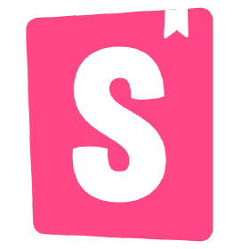

<h1 align="center">React-Based Todo List</h1>

This is a simple Todo List built with React and Typescript. For state management, the application utilizes Redux and
React Redux to keep the state organized. The user interface is designed using Material UI, providing a clean and
responsive design. To ensure reliability, the application includes unit tests with Jest, snapshot tests with Storybook
and API tests using Axios integrated with Storybook.

  <a href="https://altyalty.github.io/react-project-todo-list/">
    <strong>Link to the app</strong>
  </a>

<h3 align="center" font-size='25px'>Tech Stack</h3>

<table align="center">
  <tr>
    <td align="center" width="96">
        
       Javascript
    </td>
    <td align="center" width="96">
        
       Typescript
    </td>
    <td align="center" width="96">
        
       React
    </td>
    <td align="center" width="96">
        
       Redux
    </td>
    <td align="center" width="96">
        
       Yarn
    </td>
  </tr>

  <tr>
    <td align="center">
        
       Material UI
    </td>
    <td align="center">
        
       Jest
    </td>
    <td align="center">
        
       Storybook
    </td>
    <td align="center" colspan="2">
        
       Axios
    </td>
  </tr>
</table>

<h3 align="center" font-size='25px'>Scripts</h3>

<table align="center">
  <tr>
    <td align="center" width="200">
        <b>Script</b>
    </td>
    <td align="center" width="300">
        <b>Description</b>
    </td>
  </tr>

  <tr>
    <td>
        yarn install
    </td>
    <td>
        Installs project dependencies 
    </td>
  </tr>

  <tr>
    <td>
        yarn start
    </td>
    <td>
        Runs application
    </td>
  </tr>

  <tr>
    <td>
        yarn test
    </td>
    <td>
        Runs Jest unit tests
    </td>
  </tr>

  <tr>
    <td>
        storybook dev -p 6006
    </td>
    <td>
        Runs Storybook for snapshot testing
    </td>
  </tr>

  <tr>
    <td>
        storybook dev -p 9009
    </td>
    <td>
        Runs Storybook for API testing
    </td>
  </tr>

  <tr>
    <td>
        yarn build
    </td>
    <td>
        Makes a build for GitHub Pages
    </td>
  </tr>

  <tr>
    <td>
        gh-pages -d build
    </td>
    <td>
        Deploys the build to GitHub Pages
    </td>
  </tr>
</table>

